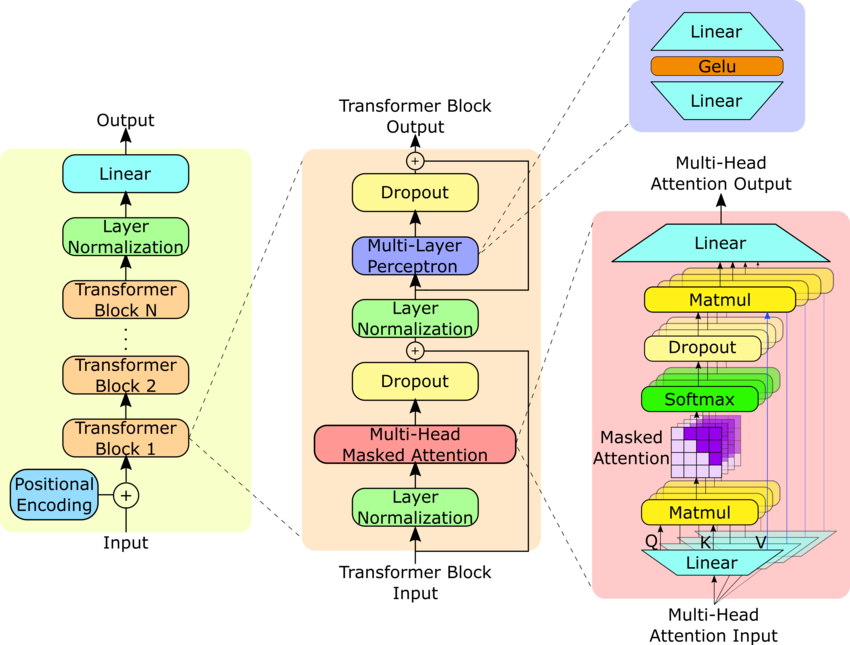

# GPT-2

An implementation of GPT in pytorch. Based on the papers: [Language Models are Unsupervised Multitask Learners](https://cdn.openai.com/better-language-models/language_models_are_unsupervised_multitask_learners.pdf) and [Improving Language Understanding by Generative Pre-Training](https://cdn.openai.com/research-covers/language-unsupervised/language_understanding_paper.pdf).

The goal is to be able to load a pre-trained model and generate text.

## Architecture Diagram

_Yang, Steve & Ali, Zulfikhar & Wong, Bryan. (2023). FLUID-GPT (Fast Learning to Understand and Investigate Dynamics with a Generative Pre-Trained Transformer): Efficient Predictions of Particle Trajectories and Erosion. 10.26434/chemrxiv-2023-ppk9s._
